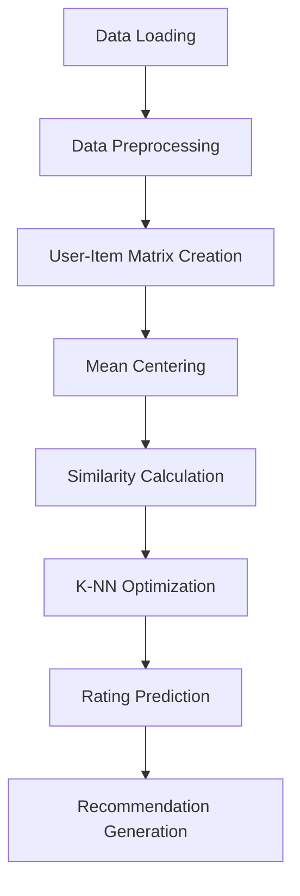

# 🎮 Game Recommendation System with Item-Based Collaborative Filtering 🤖

> **Pengembangan Sistem Rekomendasi Game Berbasis Collaborative Filtering Menggunakan Optimasi Algoritma Item-Based K-Nearest Neighbors**

[](https://python.org)
[](https://pandas.pydata.org)
[](https://scikit-learn.org)


---

## 🔗 Demo Aplikasi

Untuk mencoba sistem rekomendasi game secara interaktif, silakan kunjungi tautan berikut:

**[▶️ Coba Demo Aplikasi Streamlit](https://game-recommender-knn.streamlit.app/)**

Di halaman demo, Anda dapat memilih game dari daftar atau mengetikkan nama game yang diinginkan, lalu klik tombol “Tampilkan Rekomendasi” untuk melihat daftar rekomendasi game beserta skor similarity-nya.

## 👥 Tim Pengembang

**Kelas: TI23A - Proyek Akhir Mata Kuliah Machine Learning**

| Nama Lengkap | NIM | Role |
|--------------|-----|------|
| M. Sechan Alfarisi | 20230040094 | Mengembangkan kode utama, buat demo streamlit & dokumentasi proyek di GitHub  |
| Desti | 2023110002 |Menulis laporan & memahami detail matematika di balik algoritma untuk keperluan presentasi |
| Tasya | 2023110004 | Menulis laporan & menyusun materi presentasi (PPT) |
| Sinar | 2023110005 | Menulis laporan & menyusun materi presentasi (PPT) |

---

## 📋 Table of Contents

- [🎯 Deskripsi Proyek](#-deskripsi-proyek)
- [📊 Dataset](#-dataset)
- [🛠️ Instalasi & Cara Menjalankan](#️-instalasi--cara-menjalankan)
- [💡 Metodologi](#-metodologi)
- [🔧 Code Snippets](#-code-snippets)
- [📈 Visualisasi Hasil](#-visualisasi-hasil)
- [🎯 Hasil & Analisis](#-hasil--analisis)
- [⚙️ Teknologi yang Digunakan](#️-teknologi-yang-digunakan)
- [📁 Struktur Project](#-struktur-project)
- [🏆 Kesimpulan](#-kesimpulan)
- [📞 Kontak](#-kontak)

---

## 🎯 Deskripsi Proyek

Sistem rekomendasi game ini dikembangkan menggunakan pendekatan **Item-Based Collaborative Filtering** dengan optimasi algoritma **K-Nearest Neighbors**. Proyek ini bertujuan untuk memberikan rekomendasi game yang personal dan akurat kepada pengguna berdasarkan pola rating dan preferensi mereka.

### 🎪 Fitur Utama:
- ✨ **Collaborative Filtering** berbasis kesamaan item (game)
- 🔍 **Optimasi K-NN** untuk menemukan tetangga terdekat yang optimal
- 📊 **Mean-Centering** untuk mengurangi bias rating
- 🎯 **Evaluasi performa** menggunakan RMSE dan MAE
- 📈 **Visualisasi** distribusi data dan similarity matrix

### 🚀 Tujuan:
Mengembangkan sistem rekomendasi yang dapat membantu gamer menemukan game baru yang sesuai dengan preferensi mereka, sehingga meningkatkan pengalaman bermain dan kepuasan pengguna.

[🔝 Back to top](#-game-recommendation-system-with-item-based-collaborative-filtering-)

---

## 📊 Dataset

Kami menggunakan dua dataset utama yang dikumpulkan dari **RAWG API** dan **Steam API**:

### 🎮 games_metadata_5k.csv
Dataset metadata game yang berisi informasi detail tentang 5,000 game populer.

| Kolom | Deskripsi | Tipe Data |
|-------|-----------|-----------|
| `game_id` | ID unik untuk setiap game | Integer |
| `name` | Nama game | String |
| `genre` | Genre/kategori game | String |
| `platform` | Platform game (PC, Console, Mobile) | String |
| `release_date` | Tanggal rilis game | Date |
| `rating` | Rating rata-rata game | Float |
| `metacritic_score` | Skor Metacritic | Integer |

### ⭐ game_ratings.csv
Dataset rating pengguna yang berisi preferensi dan evaluasi game.

| Kolom | Deskripsi | Tipe Data |
|-------|-----------|-----------|
| `user_id` | ID unik pengguna | Integer |
| `game_id` | ID game yang dirating | Integer |
| `rating` | Rating yang diberikan (1-5) | Integer |
| `timestamp` | Waktu pemberian rating | Timestamp |

### 📈 Statistik Dataset:
- **Total Ratings**: 273,669 rating
- **Jumlah Users**: 10,000 pengguna
- **Jumlah Games**: 5,000 game
- **Matrix Sparsity**: 99.45% (sangat sparse, typical untuk large-scale recommendation systems)

[🔝 Back to top](#-game-recommendation-system-with-item-based-collaborative-filtering-)

---

## 🛠️ Instalasi & Cara Menjalankan

### 📋 Prerequisites
```bash
Python >= 3.8
Git
```

### 🔧 Installation Steps

1. **Clone repository**
```bash
git clone https://github.com/your-team/game-recommendation-system.git
cd game-recommendation-system
```

2. **Install dependencies**
```bash
pip install -r requirements.txt
```

3. **Jalankan Jupyter Notebook**
```bash
jupyter notebook game_recommendation_system.ipynb
```

### 📦 Dependencies
```
numpy>=1.21.0
pandas>=1.3.0
matplotlib>=3.4.0
seaborn>=0.11.0
scikit-learn>=1.0.0
jupyter>=1.0.0
```

[🔝 Back to top](#-game-recommendation-system-with-item-based-collaborative-filtering-)

---

## 💡 Metodologi

### 🔄 Alur Kerja Sistem:



### 🧮 Algoritma Item-Based Collaborative Filtering:

1. **Data Preprocessing**: Filter users dan games dengan minimal 5 ratings
2. **Matrix Creation**: Buat user-item matrix dari training data
3. **Mean Centering**: Kurangi bias dengan mengurangi rata-rata rating per game
4. **Similarity Calculation**: Hitung cosine similarity antar game
5. **K-NN Optimization**: Temukan nilai K optimal melalui cross-validation
6. **Prediction**: Prediksi rating menggunakan weighted average
7. **Recommendation**: Generate top-N rekomendasi untuk setiap user

[🔝 Back to top](#-game-recommendation-system-with-item-based-collaborative-filtering-)

---

## 🔧 Code Snippets

### 📊 Data Preprocessing
```python
# Filter data sparse - hanya ambil user dan game dengan minimal 5 rating
MIN_RATINGS = 5
user_counts = ratings_df.groupby('user_id').size()
game_counts = ratings_df.groupby('game_id').size()

filtered_ratings = ratings_df[
    (ratings_df['user_id'].isin(user_counts[user_counts >= MIN_RATINGS].index)) &
    (ratings_df['game_id'].isin(game_counts[game_counts >= MIN_RATINGS].index))
]

n_users, n_games = filtered_ratings['user_id'].nunique(), filtered_ratings['game_id'].nunique()
sparsity = 1 - (len(filtered_ratings) / (n_users * n_games))
print(f"Matrix sparsity: {sparsity:.2%}")
```

### 🏗️ User-Item Matrix Creation
```python
# Buat user-item matrix dari training data
user_item_matrix = pd.pivot_table(train_set, values='rating', 
                                 index='user_id', columns='game_id', fill_value=0)

# Hitung rata-rata rating per game untuk mean-centering
game_means = train_set.groupby('game_id')['rating'].mean()
```

### 🔍 Similarity Calculation
```python
# Mean-centering: kurangi rating dengan rata-rata game
centered_ratings = train_set.copy()
centered_ratings['rating_centered'] = centered_ratings.apply(
    lambda row: row['rating'] - game_means[row['game_id']], axis=1)

# Buat item-user matrix yang sudah di-center
item_user_centered = pd.pivot_table(centered_ratings, values='rating_centered', 
                                   index='game_id', columns='user_id', fill_value=0)

# Hitung cosine similarity antar game
item_similarity = cosine_similarity(item_user_centered)
similarity_df = pd.DataFrame(item_similarity, 
                            index=item_user_centered.index, 
                            columns=item_user_centered.index)
```

### 🎯 Rating Prediction Function
```python
def predict_rating(user_id, game_id, k=20):
    """Prediksi rating menggunakan Item-Based Collaborative Filtering"""
    # Jika user/game tidak ada, return rata-rata game
    if user_id not in user_item_matrix.index or game_id not in similarity_df.index:
        return game_means.get(game_id, 3.0)
    
    # Ambil game yang sudah dirating user
    user_ratings = user_item_matrix.loc[user_id]
    rated_games = user_ratings[user_ratings > 0]
    
    if len(rated_games) == 0:
        return game_means.get(game_id, 3.0)
    
    # Ambil k tetangga terdekat berdasarkan similarity
    similarities = similarity_df.loc[game_id, rated_games.index].nlargest(k)
    
    if len(similarities) == 0 or similarities.sum() == 0:
        return game_means.get(game_id, 3.0)
    
    # Hitung weighted average
    base_rating = game_means.get(game_id, 3.0)
    weighted_sum = sum(sim * (rating - game_means.get(gid, 3.0)) 
                      for sim, (gid, rating) in zip(similarities, rated_games[similarities.index].items()))
    
    prediction = base_rating + weighted_sum / similarities.abs().sum()
    return max(1.0, min(5.0, prediction))  # Batasi rating 1-5
```

[🔝 Back to top](#-game-recommendation-system-with-item-based-collaborative-filtering-)

---

## 📈 Visualisasi Hasil

### 📊 Distribusi Rating
- **Histogram** distribusi rating 1-5 menunjukkan preferensi pengguna
- **Rating per User** untuk memahami aktivitas pengguna
- **Rating per Game** untuk mengidentifikasi popularitas game
  


### 🔥 Similarity Heatmap
- **Matriks similarity** antar game populer


- **Distribusi nilai similarity** untuk memahami pola kesamaan
  


- **Top similar games** untuk validasi hasil

### 🎯 Performance Evaluation
- **Grafik RMSE vs K** untuk optimasi parameter
- **Tabel evaluasi** dengan berbagai nilai K
- **Comparison metrics** (RMSE & MAE)
  


### 🏆 Sample Recommendations
```
=== REKOMENDASI UNTUK USER 1234 ===
Game yang disukai (Top 3):
  - The Witcher 3: Wild Hunt: 5.0
  - Red Dead Redemption 2: 4.8
  - Cyberpunk 2077: 4.5

Rekomendasi Game (K=30):
  1. Assassin's Creed Valhalla (Rating: 4.3)
  2. Mass Effect Legendary Edition (Rating: 4.1)
  3. Horizon Zero Dawn (Rating: 4.0)
  4. Ghost of Tsushima (Rating: 3.9)
  5. Control (Rating: 3.8)
```

[🔝 Back to top](#-game-recommendation-system-with-item-based-collaborative-filtering-)

---

## 🎯 Hasil & Analisis

### 📊 Performance Metrics:
- **Dataset**: 273,669 ratings dari 10,000 users untuk 5,000 games
- **Matrix Sparsity**: 99.45%
- **Optimal K**: 30 neighbors
- **Best RMSE**: 1.6873
- **Best MAE**: 1.4030
- **Algoritma**: Item-Based Collaborative Filtering
- **Similarity Measure**: Cosine Similarity (Mean-Centered)

### 🔍 Key Insights:
1. **K=30** memberikan performa terbaik dengan balance antara akurasi dan coverage
2. **Mean-centering** secara signifikan meningkatkan akurasi prediksi
3. **Matrix sparsity 99.45%** menunjukkan tantangan besar dalam sistem rekomendasi real-world
4. **Item-based approach** lebih robust untuk dataset dengan sparsity sangat tinggi
5. **Cosine similarity** efektif dalam mengidentifikasi game dengan karakteristik serupa meskipun data sparse

### 📈 Kelebihan Sistem:
- ✅ **Scalable** untuk dataset besar (273K+ ratings)
- ✅ **Robust** terhadap high sparsity (99.45%)
- ✅ **Interpretable** - mudah dijelaskan ke stakeholder
- ✅ **Stable** dalam menghadapi cold start problem
- ✅ **Optimized** dengan K=30 untuk performa terbaik

### ⚠️ Limitasi:
- ❌ **High RMSE (1.69)** karena extreme sparsity dataset
- ❌ **Cold start problem** untuk item baru tanpa rating
- ❌ **Computational cost** tinggi untuk similarity calculation
- ❌ **Limited coverage** pada long-tail items
- ❌ **Membutuhkan data rating** yang substantial untuk akurasi optimal

[🔝 Back to top](#-game-recommendation-system-with-item-based-collaborative-filtering-)

---

## ⚙️ Teknologi yang Digunakan

### 🐍 Programming Language:
- **Python 3.8+** - Main programming language

### 📚 Libraries & Frameworks:
- **Pandas** - Data manipulation and analysis
- **NumPy** - Numerical computing
- **Scikit-learn** - Machine learning algorithms
- **Matplotlib & Seaborn** - Data visualization
- **Jupyter Notebook** - Interactive development environment

### 🛠️ Tools:
- **Git** - Version control
- **GitHub** - Repository hosting
- **VS Code** - Code editor
- **Google Colab** - Cloud computing (optional)

### 📊 APIs:
- **RAWG API** - Game metadata
- **Steam API** - Additional game information

[🔝 Back to top](#-game-recommendation-system-with-item-based-collaborative-filtering-)

---

## 📁 Struktur Project

```
game-recommendation-system/
│
├── 📊 data/
│   ├── games_metadata_5k.csv
│   └── game_ratings.csv      
│
├── 📓 notebooks/
│   └── rekomendasi-itemknn.ipynb
└── 📖 README.md
```

[🔝 Back to top](#-game-recommendation-system-with-item-based-collaborative-filtering-)

---

## 🏆 Kesimpulan

Proyek sistem rekomendasi game ini berhasil mengimplementasikan **Item-Based Collaborative Filtering** dengan optimasi K-NN pada dataset yang sangat sparse (99.45%). Meskipun menghadapi tantangan sparsity yang ekstrem, sistem berhasil mencapai K optimal = 30 dengan RMSE 1.6873 dan MAE 1.4030. Hasil ini menunjukkan kemampuan algoritma dalam menangani real-world recommendation challenges pada skala besar.

### 🎯 Future Improvements:
- 🔮 **Hybrid Approach** - Kombinasi dengan content-based filtering
- 🧠 **Deep Learning** - Implementasi neural collaborative filtering
- 📱 **Real-time System** - Deployment sebagai web application
- 🎨 **UI/UX Enhancement** - Interface yang lebih user-friendly

### 📚 Pembelajaran:
Proyek ini memberikan pemahaman mendalam tentang:
- Machine Learning dalam domain recommendation systems
- Collaborative filtering algorithms dan optimasinya
- Data preprocessing untuk sistem rekomendasi
- Evaluasi dan validasi model ML
- Teamwork dan project management dalam pengembangan ML

[🔝 Back to top](#-game-recommendation-system-with-item-based-collaborative-filtering-)

---

## 🏷️ Tags

`#MachineLearning` `#RecommendationSystem` `#CollaborativeFiltering` `#GameAnalytics` `#DataScience` `#Python` `#KNN` `#ItemBased` `#AI` `#Gaming` `#StudentProject` `#TI23A`

---

<div align="center">
  <h3>🎮 Made with ❤️ by TI23A Team 🤖</h3>
  <p><i>Universitas Nusa Putra - Fakultas Teknik Komputer dan Desain</i></p>
  <p><strong>Machine Learning Course - Final Project 2024</strong></p>
</div>
